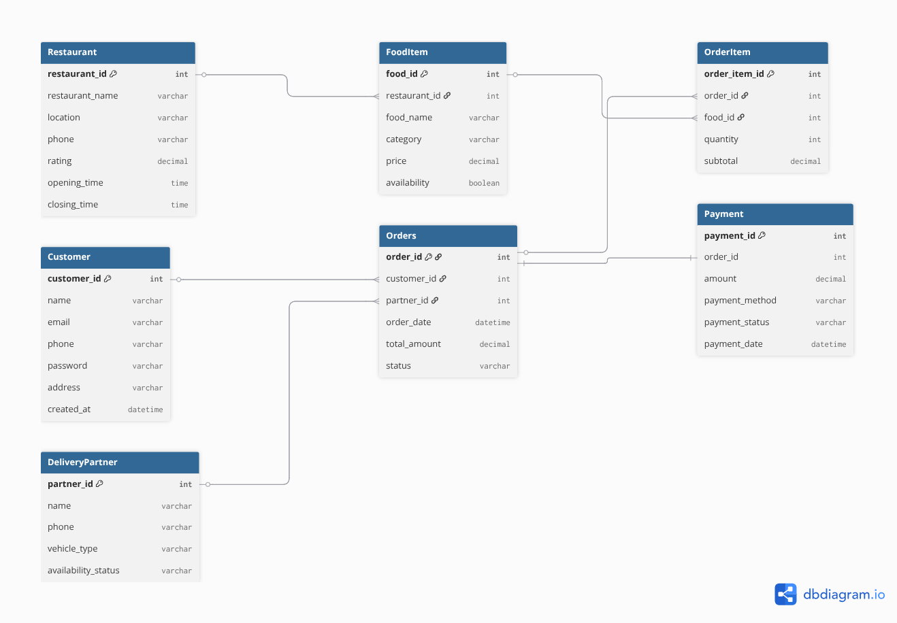

# Food Delivery Database System

Swiggy/Uber Eats inspired backend database project using PostgreSQL.

## Features

- Customer management
- Restaurant management
- Order processing
- Delivery partner assignment
- Payment processing
- Stored procedures
- Functions
- Triggers
- Transactions
- Analytics
- Performance tuning

## Technologies

- PostgreSQL
- SQL
- PL/pgSQL
- Python Faker

## Workflow

Customer
↓
Order
↓
Payment
↓
Delivery

## Screenshots

# ER Diagram

## Future Improvements

- Power BI dashboard
- APIs
- Recommendation system
